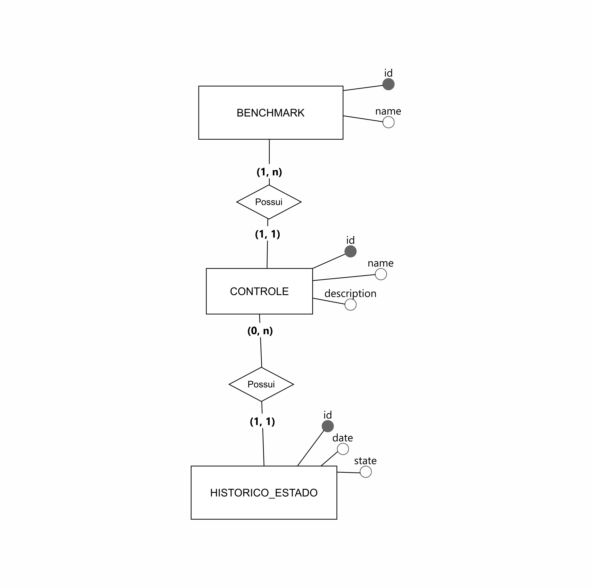

# Desafio Back-End Volcann — Processo Seletivo
Este repositório contem soluções do desafio proposto pela Valcann para vaga de estágio em Back-End.

## Resumo do Desafio
O desafio é composto por três partes:

1. **Banco de Dados (conceitual + índices básicos)**
- Mini-Mundo com os requisitos do banco de dados.
- Entidades Benchmarks, Controle e Histórico de Controle
- Definição de índices básicos conforme os cenários Q1, Q2 e Q3

## Questão 1 — Modelo Conceitual (MER)
- Entidades: Benchmark, Controle e Historico_Estado.

### Relacionamentos:
- Um Benchmark possui 1 ou muitos Controles;
- Um Controle deve pertencer a apenas 1 Benchmark;
- Um Controle possui 0 ou muitos Históricos_Estado;
- Um Historico_Estado deve pertencer a apenas 1 Controle

- Acesse a imagem do modelo conceitual em [`questao1/modelo_banco.png`](questao1/modelo_banco.png).
### Modelo Conceitual
- Link público do diagrama no BrModelo:  
  [Clique aqui!](https://app.brmodeloweb.com/#!/publicview/68bc20e90ec1bb87cf05d89b)

## Índices básicos
- **Chaves Primárias (PKs)**: Criar índices nas colunas `id` das tabelas **Benchmark**, **Controle** e **Histórico_estado**. Esses índices permitem localizar registo específico com mais rapidez, conforme o cenário Q1 e Q3.

- **Chaves Estrangeiras (FKs)**: Criar índices nas colunas `id_benchmark` da tabela **Controle** e `id_controle` na tabela **Historico_Estado**. Esses índices ajuda a acelerar as operações de junção (`JOIN`) entre as tabelas.

- **Índice Composto**: Criar índices na coluna `date` e `id_controle` na tabela **Historico_Estado**, para otimizar as buscas por um intervalo de tempo, conforme os cenário Q2 e Q3

## Questão 2 — Script em Python automatização de Ambientes Operacionais
A automação do processo de backup foi implementado em Python [**automacao.py**](questao2/automacao.py).
O Script realiza as seguintes etapas:
* **Listar os Arquivos:** Lista todos os arquivos do diretório de origem e salva o resultado em arquivo de log `backupsFrom.log`;
* **Remover os Arquivos antigos:** Remove os arquivos que foram criados há mais de 3 dias.
* **Copiar os Arquivos recentes:** Copia os arquivos mais recentes para o diretório de destino e salva o resultado no log `backupsTo.log`.

## Questão 3 — Problema -> Causa -> Solução do Deploy

### Problema
O deploy é manual, tornando o processo lento, repetitivo e sujeito a erros. Cada nova versão precisa ser copilada e implantada várias vezes, aumentando o custo e retrabalho entre homologação e produção.

### Causa
A ausência de um Pipeline automatizado para o build e deploy gera gargalos no time, inconsistências entre os ambientes e maior risco de falhas durante as atualizações.

### Solução
Implementar um Pipeline de CI/CD com o GitHub Actions ou GitLab CI.
- CI: A cada push ou pull Request, o pipeline faz o build do backend Node.js e do frontend React, roda os testes (unitários e de integração) e valida a qualidade.
- CD (Homologação): Após sucesso no CI, o pipeline faz o deploy automático no ambiente de homologação, para a equipe realizar os testes e validar a aplicação.
- CD (Produção): Com aprovação manual, o mesmo pacote de código usado na homologação é enviado para a produção, garantido a consistência entre os ambientes e menos retrabalho.

### Diagrama de Arquitetura
Git Push -> Pipeline de CI/CO -> Build e Testes -> Deploy em Homologação -> Aprovação Manual -> Deploy em Produção.